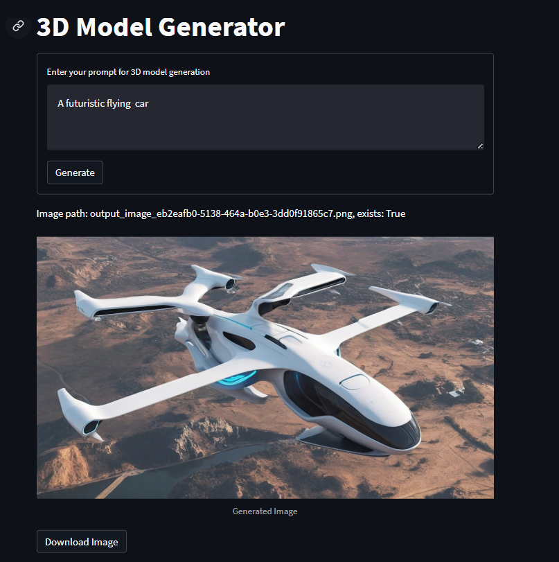
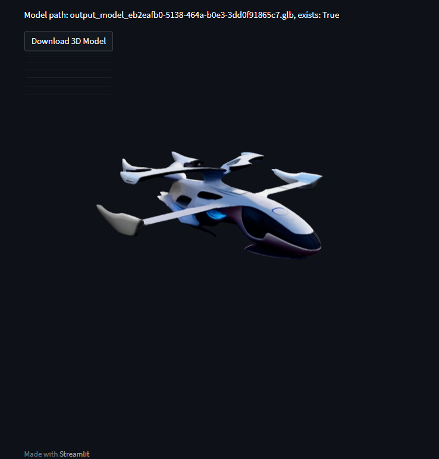

# 🧐 Text-to-3D Generator

A full-stack project that converts text prompts into 3D model files using Llama 3 (via Ollama), with FastAPI backend + Streamlit frontend — all running inside Docker.

---

## 🚀 Demo





---

## ✨ Features

- 🧐 Text prompt ➡️ Realistic 3D model generation
- 📜 Memory system for conversation context
- ⚡ FastAPI backend
- 👥 Streamlit frontend for easy UI interaction
- 🐋 Fully Dockerized deployment
- 🤖 Powered by Llama 3 (Ollama)

---

## 📋 Requirements

Install these before proceeding:

- [Docker](https://docs.docker.com/get-docker/)
- [Ollama](https://ollama.com/download) (must be installed locally)

---

## 🛠️ How to Run

### 1. Clone the Repository

```bash
git clone https://github.com/ArbazkhanPathan/Text-3D_Generator.git
cd Text-3D_Generator
```

---

### 2. Make Sure Ollama is Running

Pull and run the Llama3 model:

```bash
ollama pull llama3
ollama serve
```

This will run Ollama server at `http://localhost:11434`.

---

### 3. Build and Run the Docker Container

```bash
cd app
docker build -t text-3d .
docker run -it -p 8888:8888 -p 8501:8501 text-3d
```

---

### 4. Access the Application

Open your browser and go to:

👉 [**http://localhost:8501/**](http://localhost:8501/)

You will see the Streamlit UI!

---

## 📋 API Usage (Optional)

FastAPI server runs inside Docker at port `8888`.\
You can POST to it manually if you want:

```bash
curl -X POST http://localhost:8888/generate-3d \
  -H "Content-Type: application/json" \
  -d '{"prompt": "Create a 3D model of a futuristic car"}'
```

---

## ⚡ Quick Start (All Commands)

```bash
git clone https://github.com/ArbazkhanPathan/Text-3D_Generator.git
cd Text-3D_Generator
cd app
ollama pull llama3
ollama serve
docker build -t text-3d .
docker run -it -p 8888:8888 -p 8501:8501 text-3d
```

Access at: [**http://localhost:8501/**](http://localhost:8501/)

---

## 🤝 Contributions

Contributions are welcome!\
Open an issue or submit a pull request!

---

## 📜 License

This project is licensed under the [MIT License](LICENSE).

---

